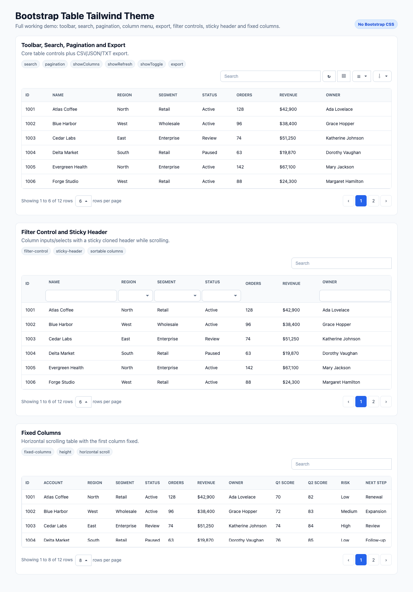

# Bootstrap Table Tailwind Theme

[English](README.md) | [Turkish](README_TR.md)

A Bootstrap Table theme package that adds a modern Tailwind CSS v4 inspired light theme without requiring Bootstrap CSS. The theme follows Bootstrap Table's existing theme architecture and can be used by importing only the Tailwind theme CSS and JavaScript files.

This Tailwind theme is prepared for Bootstrap Table currently at version `v1.27.3`.



## Highlights

- Tailwind-style neutral slate UI with blue primary actions.
- No Bootstrap CSS dependency.
- Compatible with `data-toggle="table"` and the Bootstrap Table public API.
- Theme-only JavaScript mapping for classes, icons, buttons, dropdowns, pagination and inputs.
- Browser-ready `dist` CSS with no `@tailwind` directives and no `@apply`.
- Demo coverage for search, pagination, show columns, refresh, toggle view, export, filter controls, sticky header and fixed columns.
- Full demo uses the Turkish `tr-TR` locale to show localized Bootstrap Table labels.

## Added Files

```text
src/themes/tailwind/bootstrap-table-tailwind.css
src/themes/tailwind/bootstrap-table-tailwind.js
dist/themes/tailwind/bootstrap-table-tailwind.css
dist/themes/tailwind/bootstrap-table-tailwind.min.css
dist/themes/tailwind/bootstrap-table-tailwind.js
dist/themes/tailwind/bootstrap-table-tailwind.min.js
docs/themes/tailwind.md
examples/theme/tailwind.html
tailwind-theme-demo.html
Bootstrap-Table-Tailwind-Theme-Full-Demo-2026-06-24_15_43.png
README_TR.md
```

## Full Demo

Open the full demo from the project root:

```bash
python3 -m http.server 8899
```

Then visit:

```text
http://127.0.0.1:8899/tailwind-theme-demo.html
```

The demo is split into realistic working scenarios:

- Toolbar, search, pagination, show columns and export.
- Filter control with sticky header.
- Fixed columns with horizontal scrolling.
- AJAX loading from `https://jsonplaceholder.typicode.com/comments`.

## Browser Usage

Load the Tailwind theme CSS first, then jQuery, Bootstrap Table, optional extensions and finally the Tailwind theme JavaScript.

```html
<link rel="stylesheet" href="dist/themes/tailwind/bootstrap-table-tailwind.min.css">

<script src="https://cdn.jsdelivr.net/npm/jquery@3.7.1/dist/jquery.min.js"></script>
<script src="dist/bootstrap-table.min.js"></script>
<script src="dist/extensions/filter-control/bootstrap-table-filter-control.min.js"></script>
<script src="dist/extensions/export/bootstrap-table-export.min.js"></script>
<script src="dist/themes/tailwind/bootstrap-table-tailwind.min.js"></script>
```

```html
<table
  data-toggle="table"
  data-search="true"
  data-pagination="true"
  data-show-columns="true">
  <thead>
    <tr>
      <th data-field="id" data-sortable="true">ID</th>
      <th data-field="name" data-sortable="true">Name</th>
      <th data-field="status">Status</th>
    </tr>
  </thead>
</table>
```

## Bundler Usage

```js
import 'bootstrap-table/dist/themes/tailwind/bootstrap-table-tailwind.min.css'
import 'bootstrap-table'
import 'bootstrap-table/dist/extensions/filter-control/bootstrap-table-filter-control.min.js'
import 'bootstrap-table/dist/extensions/export/bootstrap-table-export.min.js'
import 'bootstrap-table/dist/themes/tailwind/bootstrap-table-tailwind.min.js'
```

## Tailwind v4 Notes

The source CSS is authored as plain CSS inside `@layer components`, so it can pass through a Tailwind CSS v4 pipeline. It intentionally does not use:

```css
@tailwind base;
@tailwind components;
@tailwind utilities;
```

The distributed CSS files are browser-ready and do not contain `@apply`.

## Build Notes

The existing Bootstrap Table build compiles Sass files automatically. Because this theme source is intentionally a `.css` file, a small copy step is included:

```bash
npm run css:build:tailwind
```

Full CSS build:

```bash
npm run css:build
```

## Verification

The Tailwind theme stage was checked with:

```bash
node --check src/themes/tailwind/bootstrap-table-tailwind.js
node --check dist/themes/tailwind/bootstrap-table-tailwind.js
node --check dist/themes/tailwind/bootstrap-table-tailwind.min.js
```

Additional checks confirmed:

- Required Tailwind theme source and dist files exist.
- No Bootstrap CSS import is used by the Tailwind demo/theme files.
- No `@tailwind` or `@apply` exists in the distributed theme CSS.
- Core Bootstrap Table JavaScript and extension logic were not changed for Tailwind behavior.

## Git Commit

This milestone can be committed with:

```bash
git add .
git commit -m "Add Tailwind theme for Bootstrap Table"
```

## License

Bootstrap Table is released under the MIT License.
